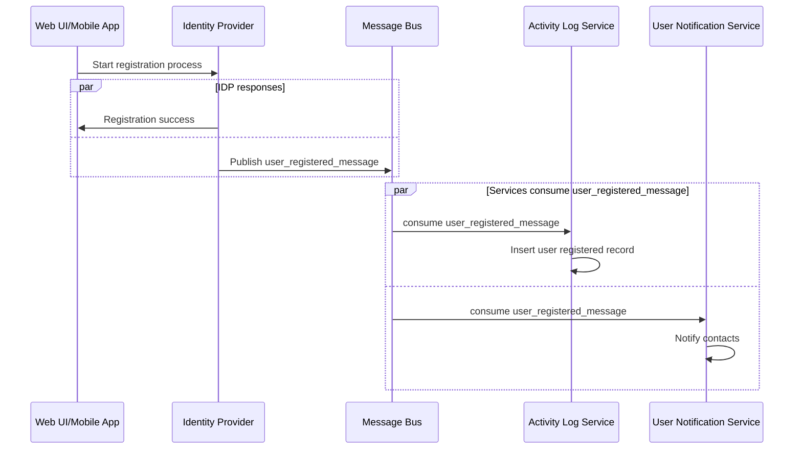
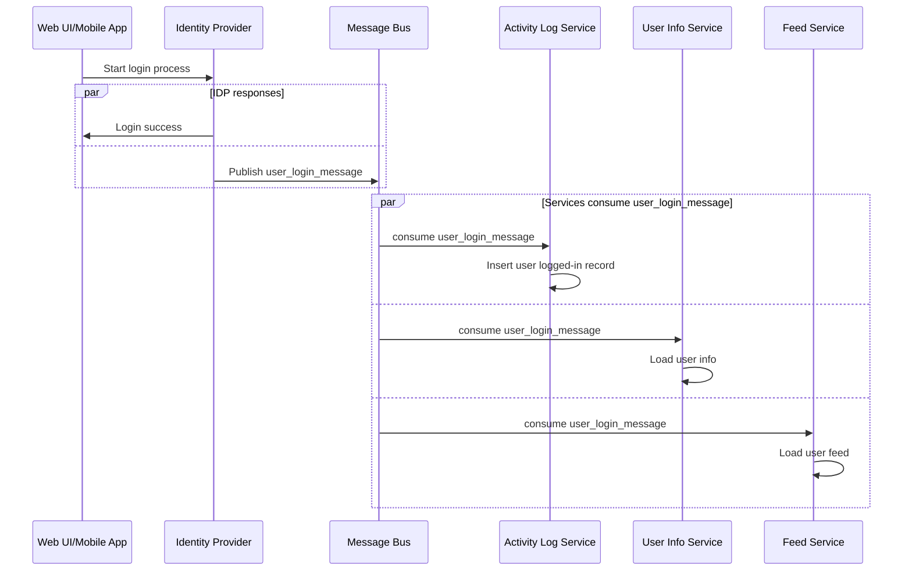

# infrastructure

infrastructure for saturn72 projects

## User Registration Flow

```mermaid
sequenceDiagram
    participant UI as Web UI/Mobile App
    participant IDP as Identity Provider
    participant MB as Message Bus
    participant Log as Activity Log Service
    participant Notify as User Notification Service

    UI->>IDP: Start registration process
    par IDP responses
        IDP->>UI: Registration success
    and
        IDP->>MB: Publish user_registered_message
    end

    par Services consume user_registered_message
        MB->>Log: consume user_registered_message
        Log->>Log: Insert user registered record

        and
        MB->>Notify: consume user_registered_message
        Notify->>Notify: Notify contacts

    end
```

## User Login Flow

```mermaid
sequenceDiagram
    participant UI as Web UI/Mobile App
    participant IDP as Identity Provider
    participant MB as Message Bus
    participant Log as Activity Log Service
    participant UserInfo as User Info Service
    participant Feed as Feed Service

    UI->>IDP: Start login process
    par IDP responses
        IDP->>UI: Login success
    and
        IDP->>MB: Publish user_login_message
    end

    par Services consume user_login_message
        MB->>Log: consume user_login_message
        Log->>Log: Insert user logged-in record

        and
        MB->>UserInfo: consume user_login_message
        UserInfo->>UserInfo: Load user info

        and
        MB->>Feed: consume user_login_message
        Feed->>Feed: Load user feed
    end
```
